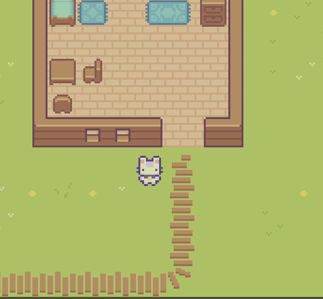
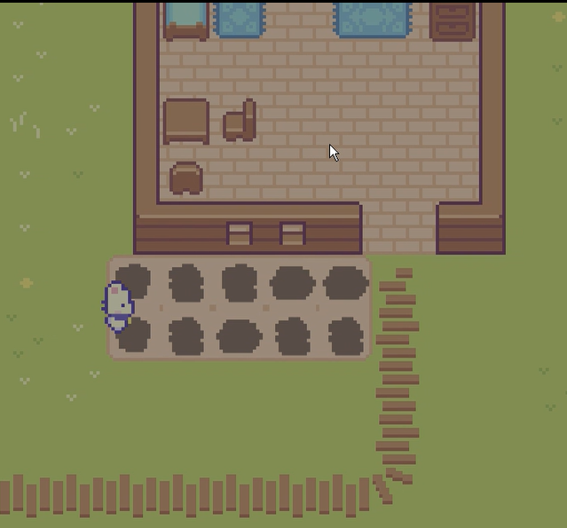
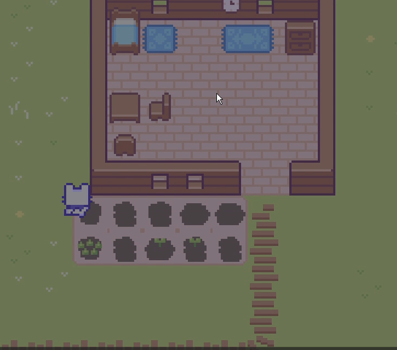
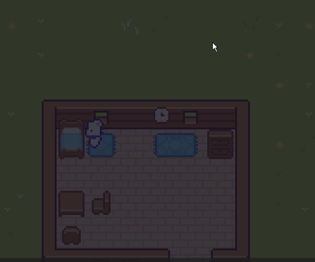
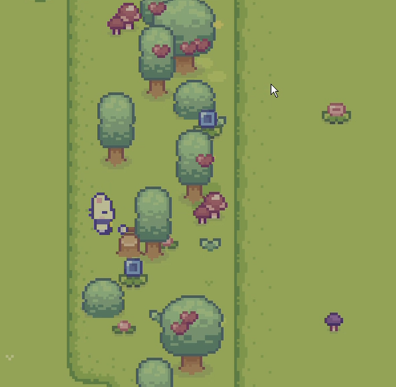
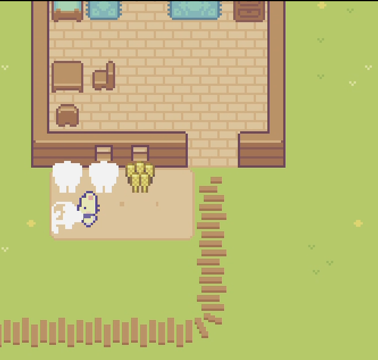
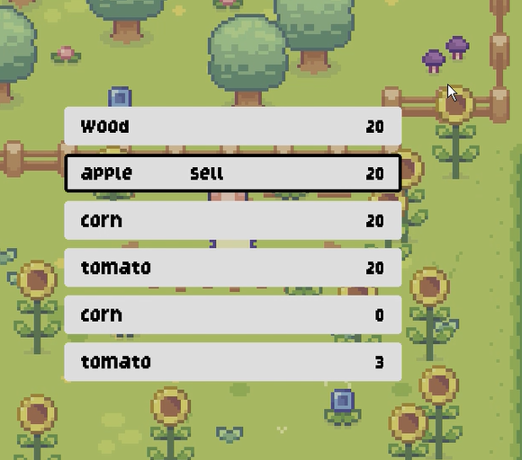

# PyDewVelly
### Mini Stardew Velly Game using Pygame

## 프로젝트 요약
 
> 2022.02.01 - 2022.02.15   
 
> **Python 개인 프로젝트**
* 미국의 농장 경영 게임인 'StarDew Valley'을 보고 간소화된 버전으로 만들어보자 하는 생각으로 제작하였습니다.
* PyGame Package를 활용하여 제작하였습니다.
* 농장 이미지, 게임 캐릭터, 수확물, 나무, 열매 등의 이미지는 유튜브 외부 링크 자료를 통해 가져왔습니다.
 

> **게임 로직 설명**
* 플레이어가 곡괭이를 사용하여 땅을 깝니다.
* 땅을 깐 뒤 물을 주고 종자를 심을 수 있습니다.
* 도끼를 사용하여 나무 혹은 같이 열려 있는 열매를 획득할 수 있습니다.
* 상점을 방문하여 필요한 종자 구매 및 수확한 열매 및 나무들을 팔 수 있습니다.
 

> **게임 방법**
* E키: 종자 변환
* Q키: 도구 변환
* CTRL키: 종자 심기
* Enter키:
  * 침대 옆으로 간 경우: 다음 날로 전환(게임 셋)
  * 상점 방문하였을 경우: 메뉴 선택 가능(종자 구입, 수확물 판매)  
* ESC키:메뉴 선택 후 창 닫기  
 

## 시연영상
https://youtu.be/Kx9QKkBcOdw
